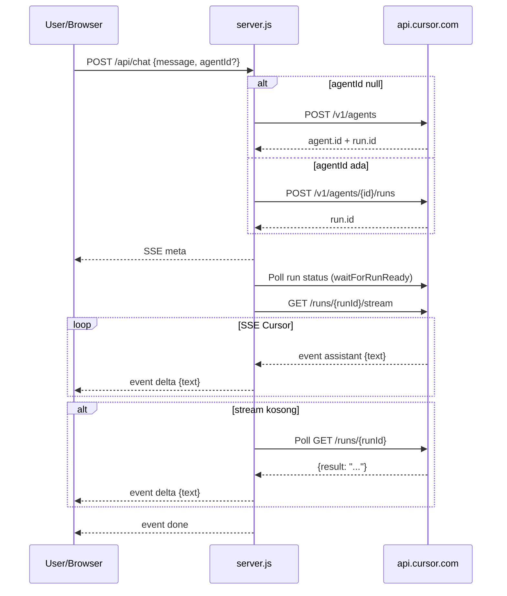

# Arsitektur Sistem — Cursor AI Chatbot

Dokumen ini menjelaskan arsitektur lengkap proyek chatbot HTML yang terintegrasi dengan **Cursor Cloud Agents API**. Fokus utama: bagaimana data mengalir dari browser ke Cursor, dan **kode-kode penting** yang menjadi kunci keberhasilan sistem.

---

## 1. Ringkasan Eksekutif

| Aspek | Detail |
|-------|--------|
| **Tipe aplikasi** | Chatbot web lokal (single-page) |
| **Stack** | HTML/CSS/JS (vanilla) + Node.js + Express |
| **AI Backend** | Cursor Cloud Agents API (`api.cursor.com`) |
| **Model** | `composer-2.5` (ditampilkan sebagai "Composer 2") |
| **Protokol chat** | Server-Sent Events (SSE) |
| **Port default** | `3000` |

Sistem ini **bukan** integrasi OpenAI `/v1/chat/completions`. Cursor memakai konsep **Agent + Run**, lalu server lokal menerjemahkannya menjadi pengalaman chat biasa.

---

## 2. Diagram Arsitektur

```
┌─────────────────────────────────────────────────────────────────┐
│                        BROWSER (Client)                         │
│  public/index.html                                              │
│  - UI chat                                                      │
│  - State: agentId, isSending                                    │
│  - fetch /api/health, /api/chat (SSE reader)                    │
└────────────────────────────┬────────────────────────────────────┘
                             │ HTTP (same-origin)
                             ▼
┌─────────────────────────────────────────────────────────────────┐
│                   SERVER LOKAL (Proxy Layer)                    │
│  server.js (Express)                                            │
│  - Sembunyikan API key                                          │
│  - Bungkus prompt chatbot                                       │
│  - Orkestrasi Agent/Run/Stream                                  │
│  - Fallback polling jika stream gagal                           │
└────────────────────────────┬────────────────────────────────────┘
                             │ HTTPS + Bearer Token
                             ▼
┌─────────────────────────────────────────────────────────────────┐
│                   CURSOR CLOUD (External API)                   │
│  api.cursor.com/v1/...                                          │
│  - POST /agents (buat sesi)                                     │
│  - POST /agents/{id}/runs (pesan lanjutan)                      │
│  - GET  /agents/{id}/runs/{runId}/stream (SSE)                  │
│  - GET  /agents/{id}/runs/{runId} (hasil final)                 │
└─────────────────────────────────────────────────────────────────┘
```

---

## 3. Struktur Folder Proyek

```
chatbot cursor/
├── public/
│   └── index.html          # Frontend: UI + logika chat client
├── server.js               # Backend: proxy + orkestrasi Cursor API
├── package.json            # Dependensi Node.js
├── .env                    # Konfigurasi rahasia (API key, port)
├── .gitignore              # Mengabaikan node_modules & .env
└── arsitektur sistem.md      # Dokumen ini
```

---

## 4. Lapisan Sistem

### 4.1 Lapisan Presentasi (Frontend)

**File:** `public/index.html`

Tanggung jawab:
- Menampilkan antarmuka chat
- Mengirim pesan ke server lokal
- Membaca stream SSE dan merender respons secara bertahap
- Menyimpan `agentId` di memori browser untuk percakapan lanjutan

Komponen UI:
- **Header** — branding, info user, badge model, tombol Chat Baru
- **Status bar** — indikator koneksi API
- **Message area** — bubble user & AI
- **Composer** — textarea + tombol Kirim

### 4.2 Lapisan Aplikasi (Backend Proxy)

**File:** `server.js`

Tanggung jawab:
- Menyajikan file statis (`public/`)
- Memverifikasi API key via `/api/health`
- Menerjemahkan request chat menjadi workflow Cursor Agent
- Mem-proxy dan menyederhanakan event SSE Cursor

### 4.3 Lapisan Integrasi (Cursor API)

Endpoint eksternal yang dipakai:

| Method | Endpoint Cursor | Fungsi |
|--------|-----------------|--------|
| `GET` | `/v1/me` | Verifikasi API key & info user |
| `POST` | `/v1/agents` | Buat agent + run pertama |
| `POST` | `/v1/agents/{id}/runs` | Kirim pesan lanjutan |
| `GET` | `/v1/agents/{id}/runs/{runId}` | Cek status & hasil run |
| `GET` | `/v1/agents/{id}/runs/{runId}/stream` | Stream respons real-time |

---

## 5. Konfigurasi & Prasyarat

### 5.1 File `.env`

```env
CURSOR_API_KEY=crsr_xxxxxxxxxxxxxxxxxxxxxxxxxxxxxxxx
PORT=3000
```

**Kunci keberhasilan #1 — API key tidak pernah di frontend:**

```javascript
// server.js
require("dotenv").config();

const API_KEY = process.env.CURSOR_API_KEY;
const CURSOR_API = "https://api.cursor.com";

if (!API_KEY) {
  console.error("CURSOR_API_KEY belum diatur di file .env");
  process.exit(1);
}
```

Browser hanya berkomunikasi ke `localhost`. API key hanya dibaca server.

### 5.2 Prasyarat Akun Cursor

1. User API key aktif dari [Cursor Dashboard → API Keys](https://cursor.com/dashboard/api)
2. **Privacy Mode** aktif (bukan Legacy) — diperlukan agar Cloud Agents API bisa jalan
3. Storage mode diaktifkan untuk agents via API

### 5.3 Menjalankan Server

```bash
npm install
npm start
```

Buka: `http://localhost:3000`

---

## 6. Alur Data Lengkap (Sequence)

### 6.1 Saat Halaman Dibuka

```
Browser → GET /api/health → server.js → GET /v1/me (Cursor)
                                              ↓
Browser ← { ok, user: { name, email } } ←────┘
```

### 6.2 Saat User Mengirim Pesan Pertama

```
1. Browser: POST /api/chat { message: "halo", agentId: null }
2. Server: buildChatPrompt("halo")
3. Server: POST /v1/agents (buat agent + run)
4. Server: kirim SSE meta { agentId, runId }
5. Server: waitForRunReady() — tunggu run RUNNING/FINISHED
6. Server: GET /stream — baca event assistant/result
7. Server: teruskan sebagai event delta ke browser
8. Browser: append teks ke bubble AI
9. Browser: simpan agentId untuk pesan berikutnya
```

### 6.3 Saat User Mengirim Pesan Lanjutan

```
1. Browser: POST /api/chat { message: "apa kabar", agentId: "bc-..." }
2. Server: POST /v1/agents/{agentId}/runs
3. (alur stream sama seperti di atas)
```

### 6.4 Saat User Klik "Chat Baru"

```
Browser: agentId = null
Pesan berikutnya → buat Agent baru di Cursor
```

---

## 7. Kode Penting sebagai Kunci Keberhasilan

Bagian ini adalah inti teknis yang **wajib benar** agar chatbot berfungsi.

---

### Kunci #2 — Model ID yang Valid

**Masalah yang pernah terjadi:** `composer-2` ditolak API dengan error `invalid_model`.

**Solusi:** gunakan ID resmi `composer-2.5`, tampilkan "Composer 2" di UI.

```javascript
// server.js
const DEFAULT_MODEL = "composer-2.5";
```

```javascript
// Saat membuat agent pertama
const body = {
  prompt: { text: promptText },
  mode: "plan",
  model: {
    id: DEFAULT_MODEL,
    params: [{ id: "fast", value: "true" }],
  },
};
```

---

### Kunci #3 — Prompt Engineering untuk Chat Biasa

Cursor Agents API dirancang untuk coding agent. Agar merespons seperti chatbot, pesan user **harus dibungkus instruksi eksplisit**.

```javascript
// server.js
function buildChatPrompt(message) {
  return `Kamu adalah chatbot AI yang ramah.
Jawab dalam Bahasa Indonesia, natural, singkat, dan langsung ke inti.
JANGAN mencari codebase. JANGAN menganalisis workspace. JANGAN memakai tools.
Hanya balas percakapan seperti chat biasa.

Pesan user:
${message}`;
}
```

Tanpa pembungkus ini, AI cenderung menganalisis workspace `/agent` dan bertindak sebagai coding agent.

---

### Kunci #4 — Mode `plan` (Bukan `agent`)

```javascript
mode: "plan"  // untuk percakapan, bukan eksekusi coding langsung
```

Mode `agent` memicu perilaku coding penuh. Untuk chat biasa, `plan` lebih sesuai.

---

### Kunci #5 — Autentikasi Bearer ke Cursor

```javascript
function cursorHeaders(extra = {}) {
  return {
    Authorization: `Bearer ${API_KEY}`,
    "Content-Type": "application/json",
    ...extra,
  };
}
```

Untuk stream SSE, header dikirim terpisah:

```javascript
const streamResponse = await fetch(
  `${CURSOR_API}/v1/agents/${currentAgentId}/runs/${runId}/stream`,
  {
    headers: {
      Authorization: `Bearer ${API_KEY}`,
      Accept: "text/event-stream",
    },
  }
);
```

---

### Kunci #6 — Pemisahan Agent Baru vs Run Lanjutan

```javascript
if (!currentAgentId) {
  // PESAN PERTAMA → buat agent baru
  const { response, data } = await cursorFetch(`${CURSOR_API}/v1/agents`, {
    method: "POST",
    headers: cursorHeaders(),
    body: JSON.stringify(body),
  });
  currentAgentId = data.agent?.id;
  runId = data.run?.id;
} else {
  // PESAN LANJUTAN → run baru pada agent yang sama
  const { response, data } = await cursorFetch(
    `${CURSOR_API}/v1/agents/${currentAgentId}/runs`,
    {
      method: "POST",
      headers: cursorHeaders(),
      body: JSON.stringify({
        prompt: { text: promptText },
        mode: "plan",
      }),
    }
  );
  runId = data.run?.id;
}
```

**Konsep Cursor:**
- **Agent** = sesi percakapan persisten
- **Run** = satu putaran tanya-jawab dalam sesi tersebut

---

### Kunci #7 — Tunggu Run Siap Sebelum Stream

**Masalah:** stream bisa gagal jika dipanggil saat run masih `CREATING`.

```javascript
async function waitForRunReady(agentId, runId) {
  for (let attempt = 0; attempt < 40; attempt += 1) {
    const { response, data } = await cursorFetch(
      `${CURSOR_API}/v1/agents/${agentId}/runs/${runId}`,
      { headers: cursorHeaders() }
    );

    if (!response.ok) return data;

    if (data.status === "RUNNING" || data.status === "FINISHED") {
      return data;
    }

    if (["ERROR", "CANCELLED", "EXPIRED"].includes(data.status)) {
      return data;
    }

    await sleep(500);
  }
  return null;
}

// Dipanggil sebelum membuka stream
await waitForRunReady(currentAgentId, runId);
```

---

### Kunci #8 — Parser SSE: Hanya Event `assistant`

Cursor mengirim event ganda (`assistant` + `interaction_update` dengan `text-delta`). Jika keduanya diproses, teks akan **duplikat**.

```javascript
const handlePayload = (eventName, payload) => {
  if (eventName === "assistant" && payload.text) {
    hasText = true;
    sendEvent("delta", { text: payload.text });
    return;
  }

  // WAJIB diabaikan untuk mencegah duplikasi
  if (eventName === "interaction_update") {
    return;
  }

  if (eventName === "result" && payload.text) {
    if (!hasText) {
      hasText = true;
      sendEvent("delta", { text: payload.text });
    }
    return;
  }

  if (eventName === "error") {
    streamFailed = true;
  }
};
```

---

### Kunci #9 — Fallback Polling Jika Stream Kosong/Gagal

**Masalah:** kadang stream tidak mengirim `assistant` delta, atau error "Run stream is no longer available".

```javascript
async function waitForRunResult(agentId, runId) {
  for (let attempt = 0; attempt < 40; attempt += 1) {
    const { response, data } = await cursorFetch(
      `${CURSOR_API}/v1/agents/${agentId}/runs/${runId}`,
      { headers: cursorHeaders() }
    );

    if (!response.ok) return null;
    if (data.result) return data.result;

    if (["ERROR", "CANCELLED", "EXPIRED"].includes(data.status)) {
      return null;
    }

    await sleep(1500);
  }
  return null;
}
```

Dipakai di dua tempat:
1. Saat `streamResponse.ok === false`
2. Setelah loop stream selesai tapi `hasText === false`

```javascript
if (!streamResponse.ok) {
  const resultText = await waitForRunResult(currentAgentId, runId);
  if (resultText) {
    sendEvent("delta", { text: resultText });
    sendEvent("done", {});
    return res.end();
  }
  // ... error handling
}

// Setelah stream loop
if (!hasText) {
  const resultText = await waitForRunResult(currentAgentId, runId);
  if (resultText) {
    sendEvent("delta", { text: resultText });
    hasText = true;
  }
}
```

---

### Kunci #10 — Format SSE Internal Server → Browser

Server menerjemahkan event Cursor ke format sederhana:

| Event ke Browser | Payload | Kapan |
|------------------|---------|-------|
| `meta` | `{ agentId, runId }` | Setelah agent/run dibuat |
| `delta` | `{ text: "..." }` | Potongan respons AI |
| `error` | `{ message: "..." }` | Gagal |
| `done` | `{}` | Stream selesai |

```javascript
const sendEvent = (event, payload) => {
  res.write(`event: ${event}\n`);
  res.write(`data: ${JSON.stringify(payload)}\n\n`);
};
```

Header respons SSE:

```javascript
res.setHeader("Content-Type", "text/event-stream; charset=utf-8");
res.setHeader("Cache-Control", "no-cache, no-transform");
res.setHeader("Connection", "keep-alive");
res.flushHeaders?.();
```

---

### Kunci #11 — Frontend: Membaca SSE Stream

```javascript
// public/index.html
const response = await fetch("/api/chat", {
  method: "POST",
  headers: { "Content-Type": "application/json" },
  body: JSON.stringify({ message, agentId }),
});

const reader = response.body.getReader();
const decoder = new TextDecoder();
let buffer = "";

while (true) {
  const { value, done } = await reader.read();
  if (done) break;

  buffer += decoder.decode(value, { stream: true });
  const parts = buffer.split("\n\n");
  buffer = parts.pop() || "";

  for (const part of parts) {
    parseSseChunk(part + "\n\n", (eventName, payload) => {
      if (eventName === "meta" && payload.agentId) {
        agentId = payload.agentId;  // simpan sesi
      }

      if (eventName === "delta" && payload.text) {
        assistantBubble.textContent += payload.text;  // efek mengetik
        messagesEl.scrollTop = messagesEl.scrollHeight;
      }

      if (eventName === "error") {
        throw new Error(payload.message);
      }
    });
  }
}
```

---

### Kunci #12 — Manajemen Sesi di Browser

```javascript
let agentId = null;  // null = chat baru

// Saat meta diterima dari server
if (eventName === "meta" && payload.agentId) {
  agentId = payload.agentId;
}

// Tombol Chat Baru → reset sesi
newChatBtn.addEventListener("click", () => {
  agentId = null;
  // ... clear UI
});
```

`agentId` disimpan **hanya di memori browser**. Refresh halaman = sesi hilang.

---

## 8. Endpoint API Lokal

### `GET /api/health`

**Tujuan:** cek koneksi & validitas API key.

**Response sukses:**
```json
{
  "ok": true,
  "user": {
    "name": "Nama User",
    "email": "user@email.com",
    "apiKeyName": "nama-key"
  }
}
```

**Response gagal:**
```json
{
  "ok": false,
  "error": "Invalid User API Key"
}
```

---

### `POST /api/chat`

**Request:**
```json
{
  "message": "halo",
  "agentId": null
}
```

**Response:** `text/event-stream`

**Contoh stream sukses:**
```
event: meta
data: {"agentId":"bc-xxx","runId":"run-xxx"}

event: delta
data: {"text":"Halo"}

event: delta
data: {"text":"!"}

event: done
data: {}
```

---

## 9. Diagram Sequence (Mermaid)



---

## 10. Keamanan

| Aspek | Implementasi |
|-------|--------------|
| API key | Hanya di `.env`, tidak di HTML/JS |
| Git | `.env` di `.gitignore` |
| CORS | Tidak relevan — same-origin (browser → localhost) |
| Autentikasi user | Belum ada (single-user lokal) |

**Risiko jika di-deploy publik tanpa perubahan:**
- Siapa saja bisa memakai chatbot & menghabiskan kuota API Cursor
- Perlu tambahan: HTTPS, auth, rate limiting

---

## 11. Error Handling

| Error | Penyebab | Solusi |
|-------|----------|--------|
| `Invalid User API Key` | Key expired/revoked | Buat key baru di Cursor Dashboard, update `.env` |
| `invalid_model` | Model ID salah | Pakai `composer-2.5`, bukan `composer-2` |
| `Storage mode is disabled` | Privacy Legacy aktif | Aktifkan Privacy Mode di Cursor settings |
| `Run stream is no longer available` | Stream terlambat | Fallback `waitForRunResult()` |
| `(Tidak ada respons teks)` | Stream kosong tanpa fallback | Sudah diperbaiki dengan polling |
| Teks duplikat | `assistant` + `interaction_update` | Abaikan `interaction_update` |

---

## 12. Keterbatasan Arsitektur

1. **Bukan chat API native** — memakai Cloud Agents API dengan prompt engineering
2. **Latensi tinggi** — 15–30 detik per respons (terutama pesan pertama)
3. **Stateless server** — `agentId` hanya di browser
4. **Single user** — tidak ada database atau multi-session
5. **Model tetap** — tidak bisa ganti model dari UI
6. **Ketergantungan internet** — wajib akses `api.cursor.com`

---

## 13. Testing

Proyek telah diuji dengan **playwright-cli**:

```bash
playwright-cli open http://localhost:3000/
playwright-cli fill e20 "halo" --submit
```

**Hasil uji sukses:**
- `halo` → "Halo! Ada yang bisa saya bantu hari ini?"
- `apa kabar` → respons percakapan lanjutan normal

---

## 14. Dependensi

```json
{
  "dependencies": {
    "dotenv": "^16.4.7",
    "express": "^4.21.2"
  }
}
```

| Paket | Fungsi |
|-------|--------|
| `express` | HTTP server, static files, routing API |
| `dotenv` | Memuat variabel dari `.env` |

Tidak ada build tool, tidak ada database, tidak ada framework frontend.

---

## 15. Checklist Keberhasilan

Gunakan checklist ini saat troubleshooting:

- [ ] `.env` berisi `CURSOR_API_KEY` valid
- [ ] `GET /api/health` mengembalikan `ok: true`
- [ ] Model di server = `composer-2.5`
- [ ] Privacy Mode Cursor aktif (bukan Legacy)
- [ ] Server berjalan di port 3000
- [ ] Browser mengakses `http://localhost:3000` (bukan file://)
- [ ] Event SSE `delta` diterima di browser
- [ ] `agentId` tersimpan setelah pesan pertama
- [ ] Fallback `waitForRunResult` aktif jika stream gagal

---

## 16. Referensi

- [Cursor APIs Overview](https://cursor.com/docs/api)
- [Cloud Agents API Endpoints](https://cursor.com/docs/cloud-agent/api/endpoints)
- [Cursor Dashboard API Keys](https://cursor.com/dashboard/api)

---

*Dokumen ini dibuat untuk proyek Cursor AI Chatbot. Terakhir diperbarui: Juli 2026.*
